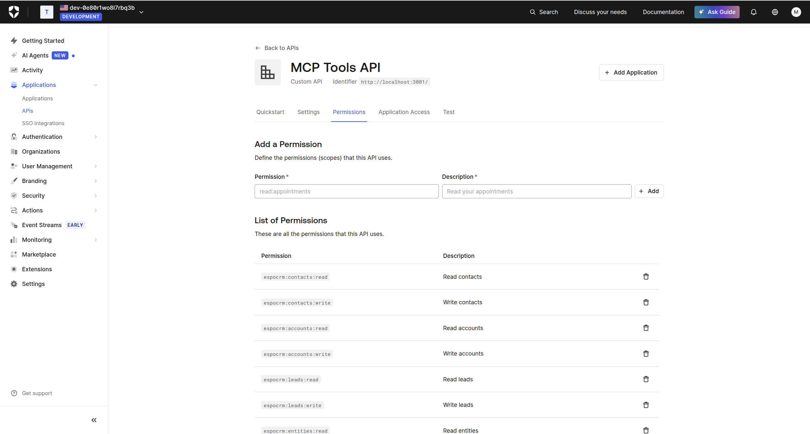
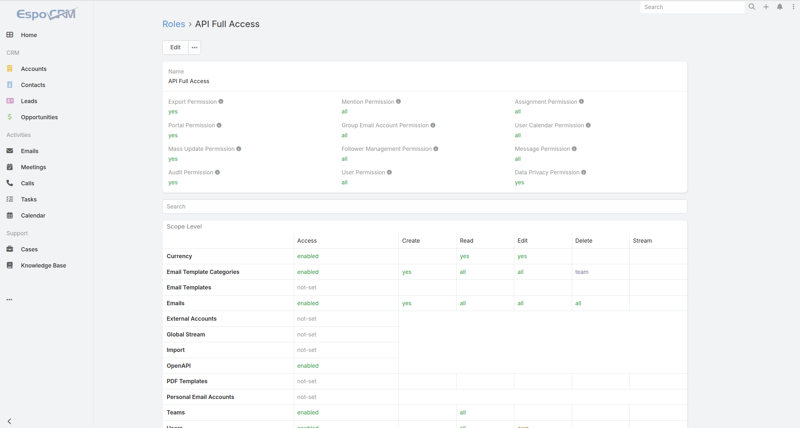
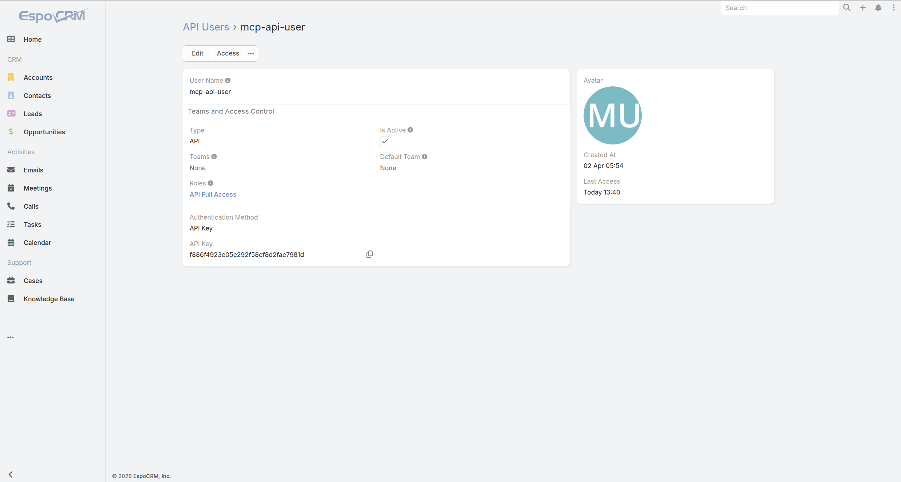
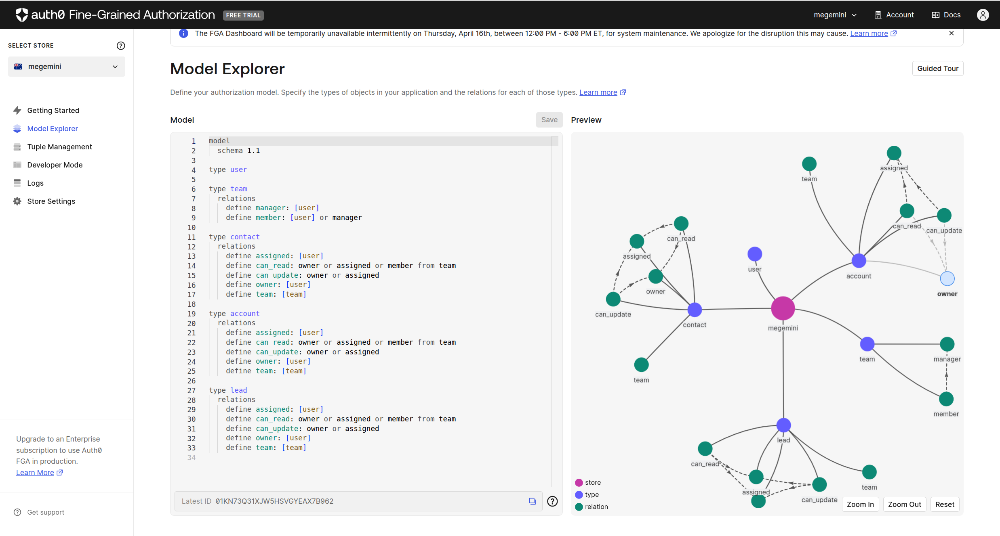
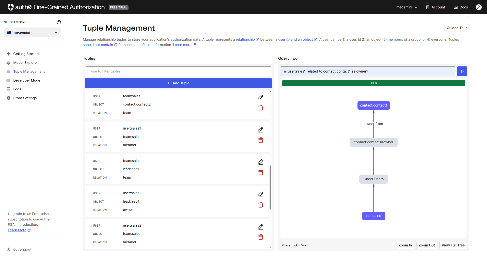
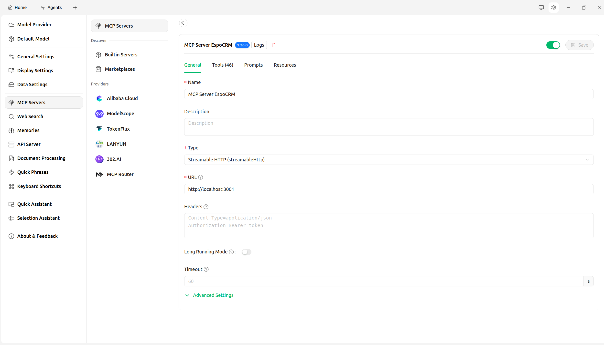

# EspoCRM MCP Server with Auth0 Authentication

A Model Context Protocol (MCP) server for EspoCRM with Auth0 authentication and authorization.


## Overview

This project provides an MCP server that integrates with EspoCRM, allowing AI assistants and other MCP clients to interact with EspoCRM data through a standardized interface. The server includes:

- **Auth0 Authentication**: Secure token-based authentication using Auth0
- **Scope-based Authorization**: Coarse-grained access control using OAuth scopes
- **FGA Fine-Grained Authorization** (Optional): Entity-level, relationship-based access control using OpenFGA
- **EspoCRM Integration**: Full API client for EspoCRM with support for both API key and HMAC authentication
- **Comprehensive MCP Tools**: Full-featured tools for managing contacts, accounts, leads, opportunities, meetings, tasks, calls, cases, notes, users, teams, and generic entity operations

## Features

### Implemented Tools

This project provides MCP tools across more than 10 categories for comprehensive EspoCRM management.
See [**Full Tool Reference**](#full-tool-reference) below for the complete list with descriptions and scope requirements.

### Authentication & Authorization

All tools (except `health_check`) require valid Auth0 authentication with appropriate scopes:
- `espocrm:contacts:read` / `espocrm:contacts:write`
- `espocrm:accounts:read` / `espocrm:accounts:write`
- `espocrm:leads:read` / `espocrm:leads:write`
- `espocrm:opportunities:read` / `espocrm:opportunities:write`
- `espocrm:meetings:read` / `espocrm:meetings:write`
- `espocrm:tasks:read` / `espocrm:tasks:write`
- `espocrm:calls:read` / `espocrm:calls:write`
- `espocrm:cases:read` / `espocrm:cases:write`
- `espocrm:notes:read` / `espocrm:notes:write`
- `espocrm:users:read`
- `espocrm:teams:read` / `espocrm:teams:write`
- `espocrm:entities:read` / `espocrm:entities:write`

#### Fine-Grained Authorization (FGA)

When FGA is enabled, additional entity-level permission checks are performed for **20+ tools** across multiple entity types:

- **Contact**: Owner (full), Assigned user (read/update), Team member (read), Manager (full)
- **Account**: Owner (full), Assigned user (read/update), Team member (read)
- **Lead**: Owner (full), Assigned user (read/update), Team member (read)
- **Meeting**: Owner (full), Assigned user (read/update)
- **Task**: Owner (full), Assigned user (read/update), Assignee (read)
- **Case**: Owner (full), Assigned user (read/update)
- **Opportunity**: Owner (full), Assigned user (read/update)
- **Generic Entities** (`get_entity`, `update_entity`, `delete_entity`, `link_entities`, `unlink_entities`): Dynamic entity-type checks at runtime

> See the [Full Tool Reference](#full-tool-reference) FGA column for per-tool details.

FGA provides defense-in-depth security by combining scope-based (coarse-grained) and entity-level (fine-grained) authorization. Permission rules are defined declaratively in `src/tools/fga_config.py` and applied automatically via decorators or runtime checks.

## Key Advantages

This architecture provides significant advantages over traditional API key-based approaches for multi-user and enterprise scenarios.

### Centralized Identity Management

**Auth0 Integration Benefits:**
- **Single Sign-On (SSO)**: Users can access multiple applications with one login
- **Social Login**: Support for Google, GitHub, Microsoft, and other identity providers
- **Multi-Factor Authentication (MFA)**: Built-in support for enhanced security
- **Password Policies**: Centralized password management and policies
- **User Lifecycle**: Automated provisioning and deprovisioning workflows

### Enterprise-Grade Authorization

**Multi-Layer Security Model:**

```
Request → Auth0 Token Validation → Scope Check → FGA Check → EspoCRM API
         (Authentication)         (Coarse-grained) (Fine-grained)
```

1. **Layer 1 - OAuth Scopes** (API-level authorization):
   - `espocrm:contacts:read` - Can user read contacts?
   - `espocrm:contacts:write` - Can user create/update contacts?

2. **Layer 2 - FGA** (Entity-level authorization):
   - Can user Alice read Contact #123?
   - Can user Bob update Lead #456?
   - Permissions computed dynamically based on relationships

**Fine-Grained Access Control:**
- Entity-level permissions (not just entity type level)
- Relationship-based access (owner, assigned user, team member)
- Hierarchical permissions (managers inherit team members' permissions)
- Dynamic authorization rules without code changes

### Deployment Architecture Benefits

**Traditional API Key Approach:**
```
User A ──> Server Instance A ──> EspoCRM (API Key A)
User B ──> Server Instance B ──> EspoCRM (API Key B)
User C ──> Server Instance C ──> EspoCRM (API Key C)

Problems:
❌ Each user needs independent deployment
❌ Resource waste (multiple server instances)
❌ Scattered configuration, hard to manage
❌ No centralized monitoring or auditing
```

**This Project (Auth0 + FGA):**
```
                    ┌─────────────────┐
User A ──> Auth0 ───>│                 │
User B ──> Auth0 ───>│  MCP Server     ├──> EspoCRM (Service Account)
User C ──> Auth0 ───>│  (Single Instance)│
                    └─────────────────┘

Advantages:
✅ Single deployment, centralized management
✅ Resource efficient (one instance serves all users)
✅ Unified monitoring and auditing
✅ Users don't manage API keys
```

### Security Enhancements

**Token-Based Security:**
- Short-lived access tokens (automatic expiration)
- Refresh token rotation
- Token revocation capabilities
- No API keys exposed to end users

**Service Account Pattern:**
- Single service account connects to EspoCRM
- User permissions enforced at MCP Server layer
- API key never exposed to users
- Easier to rotate and manage credentials

**Compliance Ready:**
- Centralized audit logs in Auth0
- Session management and tracking
- Support for compliance requirements (SOC2, GDPR, HIPAA)

### Use Cases

**Ideal For:**

1. **Multi-Application Environments**
   - Multiple apps accessing same EspoCRM data
   - Need SSO across web, mobile, and API clients
   - Example: Sales portal, customer portal, admin dashboard

2. **Complex Organizational Structures**
   - Matrix organizations (users in multiple teams)
   - Hierarchical permissions (managers → teams → entities)
   - Cross-departmental access rules
   - Example: Regional managers access their region's data

3. **External User Access**
   - Customer portal with self-service access
   - Partner integration with limited permissions
   - Contractor access with temporary permissions
   - Example: Customers view only their account data

4. **Regulatory Compliance**
   - HIPAA (healthcare data access control)
   - GDPR (data privacy and access rights)
   - SOX (financial data segregation)
   - Example: Healthcare CRM with patient data access logging

5. **Dynamic Permission Requirements**
   - Frequently changing permission rules
   - Complex business logic for access control
   - Need to modify permissions without code deployment
   - Example: Project-based access, seasonal permissions

### Comparison Summary

| Feature | Traditional API Key Approach | This Project (Auth0 + FGA) |
|---------|------------------------------|----------------------------|
| **Deployment** | Per-user independent deployment | Single deployment, multi-user |
| **Authentication** | EspoCRM API Key per user | Auth0 OAuth Token |
| **Authorization** | EspoCRM RBAC only | OAuth Scopes + FGA |
| **Identity Management** | EspoCRM users | Auth0 centralized |
| **API Key Security** | Exposed to users | Service account (hidden) |
| **Permission Granularity** | Role-based | Entity-level + relationships |
| **SSO Support** | No | Yes |
| **External Users** | Not supported | Fully supported |
| **Compliance** | Manual | Built-in |
| **Maintenance** | High (distributed) | Low (centralized) |
| **Cost** | Lower initial | Higher initial, lower long-term |

## Installation

### Prerequisites

- Python 3.10 or higher
- pip (Python package manager)
- Auth0 account with configured API
- EspoCRM instance with API access

### Setup

1. **Clone the repository**
   ```bash
   cd EspoCRM-MCP-Auth0
   ```

2. **Create and activate virtual environment**
   ```bash
   # Create virtual environment
   python -m venv venv

   # Activate virtual environment
   # On Linux/macOS:
   source venv/bin/activate

   # On Windows:
   # venv\Scripts\activate
   ```

3. **Install dependencies**
   ```bash
   pip install -r requirements.txt
   ```

4. **Configure environment variables**
   ```bash
   cp .env.example .env
   ```

   Edit `.env` with your configuration:
   ```env
   # Auth0 Configuration
   AUTH0_DOMAIN=your-tenant.us.auth0.com
   AUTH0_AUDIENCE=https://your-api-identifier
   MCP_SERVER_URL=http://localhost:3001

   # EspoCRM Configuration
   ESPOCRM_URL=https://your-espocrm-instance.com
   ESPOCRM_API_KEY=your-api-key
   ESPOCRM_SECRET_KEY=your-secret-key-for-hmac
   ESPOCRM_AUTH_METHOD=apikey

   # Server Configuration
   PORT=3001
   DEBUG=true
   CORS_ORIGINS=*

   # OAuth Configuration (Optional - for dynamic token acquisition via Auth0 Universal Login)
   OAUTH_ENABLED=false
   OAUTH_CLIENT_ID=your-auth0-application-client-id
   OAUTH_CLIENT_SECRET=your-auth0-application-client-secret
   OAUTH_SECRET_KEY=your-random-secret-key-for-session-encryption

   # FGA Configuration (Optional - for fine-grained authorization)
   FGA_ENABLED=false
   FGA_API_URL=https://api.us1.fga.dev
   FGA_API_ISSUER=auth.fga.dev
   FGA_API_AUDIENCE=https://api.us1.fga.dev/
   FGA_STORE_ID=your-fga-store-id
   FGA_CLIENT_ID=your-fga-client-id
   FGA_CLIENT_SECRET=your-fga-client-secret
   FGA_AUTHORIZATION_MODEL_ID=your-authorization-model-id
   ```

5. **(Optional) Configure OAuth for Dynamic Token Acquisition**

   Enable OAuth if you want MCP clients (e.g., CherryStudio) to authenticate interactively via Auth0 Universal Login. See [OAuth Setup](#oauth-setup-optional) for detailed instructions.

6. **(Optional) Initialize FGA**

   If you want to use fine-grained authorization:

   ```bash
   # First, configure FGA credentials in .env
   # Then run the initialization script
   python scripts/fga_init.py
   ```

   This will create the authorization model and sample data. Add the returned model ID to your `.env` file.

7. **(Optional) Initialize Demo Data**

   Create sample entities in EspoCRM with matching FGA permissions for testing:

   ```bash
   python scripts/demo_init.py "<your-auth0-user-sub>"
   ```

   The `auth0_user_sub` is your Auth0 user ID (e.g., `auth0|6abc123def456`), which you can find in **Auth0 Dashboard → User Management → Users → User ID**.

   This script will:
   - Create sample Accounts, Contacts, and Leads in EspoCRM
   - Write FGA tuples granting your Auth0 user owner permissions on these entities

   > **Note**: Requires EspoCRM to be running and the API user to have create permissions. If FGA is not configured, only EspoCRM entities will be created.

8. **Run the server**
   ```bash
   python -m src.server
   ```

   Or using uvicorn directly:
   ```bash
   uvicorn src.server:app --port 3001
   ```

## Configuration

### Auth0 Setup

1. Create an API in your Auth0 dashboard
2. Set the API identifier as `AUTH0_AUDIENCE`
3. Configure scopes for the API:
   - `espocrm:contacts:read` / `espocrm:contacts:write`
   - `espocrm:accounts:read` / `espocrm:accounts:write`
   - `espocrm:leads:read` / `espocrm:leads:write`
   - `espocrm:opportunities:read` / `espocrm:opportunities:write`
   - `espocrm:meetings:read` / `espocrm:meetings:write`
   - `espocrm:tasks:read` / `espocrm:tasks:write`
   - `espocrm:calls:read` / `espocrm:calls:write`
   - `espocrm:cases:read` / `espocrm:cases:write`
   - `espocrm:notes:read` / `espocrm:notes:write`
   - `espocrm:users:read`
   - `espocrm:teams:read` / `espocrm:teams:write`
   - `espocrm:entities:read` / `espocrm:entities:write`



### EspoCRM Setup

1. **Create a Role for API access**:
   - Go to EspoCRM **Administration** → **Roles** → **Create Role**
   - Set a name (e.g., `API Full Access`)
   - Grant **read**, **create**, **edit**, **delete** permissions for the entity types you need (Account, Contact, Lead, etc.)
   - Save the Role



2. **Create an API User**:
   - Go to **Administration** → **API Users** → **Create API User**
   - Assign the Role created in step 1
   - Choose authentication method:

   **API Key Authentication** (simpler):
   - Set `ESPOCRM_AUTH_METHOD=apikey`
   - Set `ESPOCRM_API_KEY` to the generated API key

   **HMAC Authentication** (more secure):
   - Set `ESPOCRM_AUTH_METHOD=hmac`
   - Set both `ESPOCRM_API_KEY` and `ESPOCRM_SECRET_KEY`

   > **Note**: If the API user has no Role assigned, all API requests will return `403 Forbidden`.



### FGA Setup (Optional)

Fine-Grained Authorization provides entity-level access control. To enable FGA:

1. **Create FGA Account**:
   - Sign up at [Okta FGA](https://fga.dev) or use [OpenFGA](https://openfga.dev)
   - Create a new store
   - Generate client credentials

2. **Configure FGA**:
   - Set `FGA_ENABLED=true` in your `.env` file
   - Add your FGA credentials:
     - `FGA_API_URL`: FGA API endpoint (e.g., `https://api.us1.fga.dev`)
     - `FGA_STORE_ID`: Your FGA store ID
     - `FGA_CLIENT_ID`: Your FGA client ID
     - `FGA_CLIENT_SECRET`: Your FGA client secret
     - `FGA_API_ISSUER`: (Optional) Default is `auth.fga.dev`
     - `FGA_API_AUDIENCE`: (Optional) Default is derived from API URL

3. **Initialize Authorization Model**:
   ```bash
   python scripts/fga_init.py
   ```

   This creates the authorization model for EspoCRM entities and writes sample tuples. The script will output the authorization model ID - add this to your `.env` file as `FGA_AUTHORIZATION_MODEL_ID`.

   > **Note**: The `fga_init.py` script defines FGA types for `contact`, `account`, and `lead` only (suitable for basic demos). The full toolset also uses FGA checks on `meeting`, `task`, `case`, and `opportunity` entities, plus dynamic entity types via generic tools. For production use, extend the authorization model in `fga_init.py` or your FGA console to include these additional type definitions. See `src/tools/fga_config.py` for the complete list of FGA rules.

4. **How It Works**:
   - FGA rules are defined declaratively in `src/tools/fga_config.py` (20+ rules for different tools)
   - For static entity types: `@apply_fga("tool_name")` decorator applies the rule automatically
   - For dynamic entity types (generic tools): runtime `check_fga_dynamic()` checks at call time
   - Both scope and FGA checks are applied (defense-in-depth)
   - If FGA is not configured, only scope-based authorization is used
   - The initialization script can be run multiple times safely (handles duplicates)





### OAuth Setup (Optional)

OAuth enables dynamic token acquisition via Auth0 Universal Login, allowing MCP clients to authenticate interactively without manually managing tokens.

1. **Create Auth0 Application**:
   - Go to Auth0 Dashboard → Applications → Create Application
   - Choose "Regular Web Application"
   - Note the Client ID and Client Secret

2. **Configure Callback URLs** (in the application's Settings tab):
   - Add `http://localhost:3001/auth/callback` to Allowed Callback URLs
   - Add `http://localhost:3001` to Allowed Web Origins
   - Add `http://localhost:3001` to Allowed Logout URLs

3. **Configure API**:
   - Ensure your API is configured with the correct scopes
   - The API identifier should match `AUTH0_AUDIENCE`

4. **Generate `OAUTH_SECRET_KEY`**:
   ```bash
   python -c "import secrets; print(secrets.token_urlsafe(32))"
   ```

5. **Update `.env`**:
   ```env
   OAUTH_ENABLED=true
   OAUTH_CLIENT_ID=<your-auth0-app-client-id>
   OAUTH_CLIENT_SECRET=<your-auth0-app-client-secret>
   OAUTH_SECRET_KEY=<generated-secret-from-step-4>
   ```

## Integration with AI Assistants

This MCP server can be integrated with AI assistants like Claude Desktop or CherryStudio to enable natural language interaction with EspoCRM data.

### Integration with CherryStudio

1. **Start the MCP server**:
   ```bash
   cd EspoCRM-MCP-Auth0/EspoCRM-MCP-Auth0
   source venv/bin/activate
   python -m src.server
   ```

2. **Configure CherryStudio**:
   - **Server Type**: Streamable HTTP
   - **Server URL**: `http://localhost:3001`
   - No Bearer Token needed

3. **Authentication Flow** (automatic):
   - CherryStudio sends a request → server returns 401 with OAuth metadata
   - CherryStudio discovers Auth0 via `/.well-known/oauth-protected-resource`
   - Browser opens Auth0 Universal Login Page for user authentication
   - After login, CherryStudio receives the access token automatically
   - Token is included in all subsequent MCP requests



## Usage Examples

Here are practical examples of using the MCP server through Claude or CherryStudio with natural language:

### 1. Health Check

**User**: "Check EspoCRM connection status"

**AI Assistant invokes**: `health_check()`

**Result**:
```json
{
  "status": "healthy",
  "user": "admin",
  "version": "7.5.0"
}
```

### 2. Creating a Contact

**User**: "Create a new contact in EspoCRM:
- Name: John Smith
- Email: john.smith@example.com
- Phone: +1-555-0100
- Title: Sales Manager"

**AI Assistant invokes**:
```python
create_contact(
    first_name="John",
    last_name="Smith",
    email_address="john.smith@example.com",
    phone_number="+1-555-0100",
    title="Sales Manager"
)
```

**Result**: `Successfully created contact: John Smith (ID: 123abc)`

### 3. Searching Contacts

**User**: "Find all contacts with last name 'Smith'"

**AI Assistant invokes**:
```python
search_contacts(search_term="Smith")
```

**Result**:
```
Found 3 contacts:
  - ID: 123abc, Name: John Smith
  - ID: 456def, Name: Jane Smith
  - ID: 789ghi, Name: Bob Smith
```

### 4. Getting Contact Details

**User**: "Get detailed information for contact ID 123abc"

**AI Assistant invokes**:
```python
get_contact(contact_id="123abc")
```

**Result**:
```json
{
  "id": "123abc",
  "firstName": "John",
  "lastName": "Smith",
  "emailAddress": "john.smith@example.com",
  "phoneNumber": "+1-555-0100",
  "title": "Sales Manager",
  "accountId": "acc123",
  "accountName": "ABC Corporation",
  "createdAt": "2024-01-15 10:30:00",
  "modifiedAt": "2024-01-15 10:30:00"
}
```

### 5. Creating an Account

**User**: "Create a new company:
- Name: Tech Solutions Inc.
- Type: Customer
- Industry: Information Technology
- Website: https://techsolutions.com
- Email: info@techsolutions.com"

**AI Assistant invokes**:
```python
create_account(
    name="Tech Solutions Inc.",
    account_type="Customer",
    industry="Information Technology",
    website="https://techsolutions.com",
    email_address="info@techsolutions.com"
)
```

**Result**: `Successfully created account: Tech Solutions Inc. (ID: acc456)`

### 6. Searching Accounts

**User**: "Find all companies in the Information Technology industry"

**AI Assistant invokes**:
```python
search_accounts(industry="Information Technology")
```

**Result**:
```
Found 2 accounts:
  - ID: acc456, Name: Tech Solutions Inc.
  - ID: acc789, Name: Data Systems Corp.
```

### 7. Creating a Lead

**User**: "Create a new sales lead:
- Name: Alice Johnson
- Source: Website
- Email: alice.johnson@example.com
- Company: Tech Solutions Inc.
- Status: New
- Notes: Submitted through website contact form"

**AI Assistant invokes**:
```python
create_lead(
    first_name="Alice",
    last_name="Johnson",
    source="Website",
    email_address="alice.johnson@example.com",
    account_name="Tech Solutions Inc.",
    status="New",
    description="Submitted through website contact form"
)
```

**Result**: `Successfully created lead: Alice Johnson (ID: lead789)`

### 8. Searching Leads

**User**: "Show me all new leads from the website"

**AI Assistant invokes**:
```python
search_leads(source="Website", status="New")
```

**Result**:
```
Found 5 leads:
  - ID: lead789, Name: Alice Johnson
  - ID: lead101, Name: Bob Williams
  - ID: lead102, Name: Carol Davis
  - ID: lead103, Name: David Brown
  - ID: lead104, Name: Eve Wilson
```

### 9. Generic Entity Search

**User**: "Search for opportunities with 'Tech' in the name"

**AI Assistant invokes**:
```python
search_entity(
    entity_type="Opportunity",
    filters={"name": "Tech"},
    select=["id", "name", "amount", "stage", "probability"],
    limit=10
)
```

**Result**:
```
Found 2 Opportunity:
  - ID: opp123, Name: Tech Project Deal
  - ID: opp456, Name: Tech Renewal Opportunity
```

### 10. Getting Any Entity Details

**User**: "Get opportunity opp123 details, show only name, amount, and stage"

**AI Assistant invokes**:
```python
get_entity(
    entity_type="Opportunity",
    entity_id="opp123",
    select=["name", "amount", "stage"]
)
```

**Result**:
```json
{
  "id": "opp123",
  "name": "Tech Project Deal",
  "amount": 50000,
  "stage": "Negotiation"
}
```

### 11. Creating an Opportunity

**User**: "Create a sales opportunity:
- Name: Tech Solutions Platform License
- Account: Tech Solutions Inc.
- Stage: Qualification
- Amount: $75,000
- Close Date: 2025-06-30"

**AI Assistant invokes**:
```python
create_opportunity(
    name="Tech Solutions Platform License",
    account_id="acc456",
    stage="Qualification",
    amount=75000,
    close_date="2025-06-30"
)
```

**Result**: `Successfully created opportunity: Tech Solutions Platform License (Qualification) (ID: opp789)`

### 12. Creating a Meeting

**User**: "Schedule a meeting with John Smith:
- Topic: Q1 Product Demo
- Date: 2025-04-15 10:00
- End Time: 2025-04-15 11:00
- Location: Conference Room A"

**AI Assistant invokes**:
```python
create_meeting(
    name="Q1 Product Demo",
    date_start="2025-04-15T10:00:00Z",
    date_end="2025-04-15T11:00:00Z",
    location="Conference Room A",
    contacts_ids=["123abc"]
)
```

**Result**: `Successfully created meeting: Q1 Product Demo (Planned) (ID: meeting001)`

### 13. Creating a Task

**User**: "Create a follow-up task for Alice Johnson's lead:
- Subject: Follow up on website inquiry
- Due: 2025-04-20
- Priority: High"

**AI Assistant invokes**:
```python
create_task(
    name="Follow up on website inquiry",
    status="Not Started",
    priority="High",
    due_date="2025-04-20",
    parent_type="Lead",
    parent_id="lead789"
)
```

**Result**: `Successfully created task: Follow up on website inquiry (High) (ID: task001)`

### 14. Logging a Call

**User**: "Log an outbound call with Bob Williams about the renewal:

**AI Assistant invokes**:
```python
create_call(
    name="Renewal Discussion - Bob Williams",
    direction="Outbound",
    status="Held",
    description="Discussed annual contract renewal, interested in upgrading"
)
```

**Result**: `Successfully logged call: Renewal Discussion - Bob Williams (Outbound) (ID: call001)`

### 15. Creating a Support Case

**User**: "Create a support case for Tech Solutions Inc:
- Name: Integration issue with API v2
- Type: Problem
- Priority: High"

**AI Assistant invokes**:
```python
create_case(
    name="Integration issue with API v2",
    case_type="Problem",
    priority="High",
    account_id="acc456",
    description="Customer reports errors when using API v2 endpoints"
)
```

**Result**: `Successfully created case: Integration issue with API v2 (High) (ID: case001)`

### 16. Adding a Note

**User**: "Add a note to contact John Smith: Discussed pricing options during call, sent proposal via email."

**AI Assistant invokes**:
```python
add_note(
    parent_type="Contact",
    parent_id="123abc",
    post="Discussed pricing options during call, sent proposal via email."
)
```

**Result**: `Successfully added note to Contact 123abc (ID: note001)`

### 17. Searching Users

**User**: "Find active users named 'admin' in the system"

**AI Assistant invokes**:
```python
search_users(search_term="admin", is_active=True)
```

**Result**:
```
Found 2 users:
  - ID: user1, Name: admin (admin@example.com), Role: Administrator
  - ID: user2, Name: Sarah Admin (sarah.admin@company.com), Role: Manager
```

### 18. Managing Teams

**User**: "Add user user1 to team Sales Team"

**AI Assistant invokes**:
```python
add_user_to_team(user_id="user1", team_id="team_sales")
```

**Result**: `Successfully added user user1 to team team_sales`

## API Reference

### System Tools

#### Health Check
```python
health_check() -> str
```
Returns the connection status and EspoCRM version information. No authentication required.

---

### Contact Management

#### Create Contact
```python
create_contact(
    first_name: str,
    last_name: str,
    email_address: str | None = None,
    phone_number: str | None = None,
    account_id: str | None = None,
    title: str | None = None,
    department: str | None = None,
    description: str | None = None
) -> str
```
**Scope**: `espocrm:contacts:write`

#### Search Contacts
```python
search_contacts(
    search_term: str | None = None,
    email_address: str | None = None,
    phone_number: str | None = None,
    account_id: str | None = None,
    limit: int = 20,
    offset: int = 0
) -> str
```
**Scope**: `espocrm:contacts:read`

#### Get Contact
```python
get_contact(contact_id: str) -> str
```
**Scope**: `espocrm:contacts:read` + **FGA** (owner/assigned user/team member)

---

### Account Management

#### Create Account
```python
create_account(
    name: str,
    account_type: str | None = None,
    industry: str | None = None,
    website: str | None = None,
    email_address: str | None = None,
    phone_number: str | None = None,
    description: str | None = None
) -> str
```
**Scope**: `espocrm:accounts:write`

#### Search Accounts
```python
search_accounts(
    name: str | None = None,
    account_type: str | None = None,
    industry: str | None = None,
    limit: int = 20,
    offset: int = 0
) -> str
```
**Scope**: `espocrm:accounts:read`

---

### Lead Management

#### Create Lead
```python
create_lead(
    first_name: str,
    last_name: str,
    source: str,
    email_address: str | None = None,
    phone_number: str | None = None,
    account_name: str | None = None,
    website: str | None = None,
    industry: str | None = None,
    assigned_user_id: str | None = None,
    status: str = "New",
    description: str | None = None
) -> str
```
**Scope**: `espocrm:leads:write`

#### Search Leads
```python
search_leads(
    name: str | None = None,
    status: str | None = None,
    source: str | None = None,
    email_address: str | None = None,
    account_name: str | None = None,
    limit: int = 20,
    offset: int = 0
) -> str
```
**Scope**: `espocrm:leads:read`

#### Update Lead
```python
update_lead(lead_id: str, **kwargs) -> str
```
**Scope**: `espocrm:leads:write` + **FGA** (owner/assigned user)

---

#### Convert Lead
```python
convert_lead(
    lead_id: str,
    create_account: bool = True,
    create_contact: bool = True,
    create_opportunity: bool = True,
    opportunity_amount: float | None = None,
    opportunity_stage: str = "Qualification"
) -> str
```
**Scope**: `espocrm:leads:write` + **FGA** (owner)

#### Assign Lead
```python
assign_lead(lead_id: str, user_id: str) -> str
```
**Scope**: `espocrm:leads:write`

---

### Opportunity Management

#### Create Opportunity
```python
create_opportunity(
    name: str,
    account_id: str,
    stage: str,
    amount: float | None = None,
    close_date: str | None = None,
    probability: int | None = None,
    description: str | None = None
) -> str
```
**Scope**: `espocrm:opportunities:write`

#### Search Opportunities
```python
search_opportunities(
    name: str | None = None,
    stage: str | None = None,
    min_amount: float | None = None,
    max_amount: float | None = None,
    account_id: str | None = None,
    limit: int = 20,
    offset: int = 0
) -> str
```
**Scope**: `espocrm:opportunities:read`

---

### Meeting Management

#### Create Meeting
```python
create_meeting(
    name: str,
    date_start: str,
    date_end: str,
    location: str | None = None,
    description: str | None = None,
    status: str = "Planned",
    parent_type: str | None = None,
    parent_id: str | None = None,
    contacts_ids: list[str] | None = None,
    users_ids: list[str] | None = None
) -> str
```
**Scope**: `espocrm:meetings:write`

#### Search Meetings
```python
search_meetings(
    date_from: str | None = None,
    date_to: str | None = None,
    status: str | None = None,
    location: str | None = None,
    limit: int = 20,
    offset: int = 0
) -> str
```
**Scope**: `espocrm:meetings:read`

#### Get Meeting
```python
get_meeting(meeting_id: str) -> str
```
**Scope**: `espocrm:meetings:read` + **FGA** (owner/assigned user)

#### Update Meeting
```python
update_meeting(meeting_id: str, **kwargs) -> str
```
**Scope**: `espocrm:meetings:write` + **FGA** (owner/assigned user)

---

### Task Management

#### Create Task
```python
create_task(
    name: str,
    status: str = "Not Started",
    priority: str = "Normal",
    due_date: str | None = None,
    parent_type: str | None = None,
    parent_id: str | None = None,
    assigned_user_id: str | None = None,
    description: str | None = None
) -> str
```
**Scope**: `espocrm:tasks:write`

#### Search Tasks
```python
search_tasks(
    name: str | None = None,
    status: str | None = None,
    priority: str | None = None,
    assigned_user_id: str | None = None,
    date_from: str | None = None,
    date_to: str | None = None,
    limit: int = 20,
    offset: int = 0
) -> str
```
**Scope**: `espocrm:tasks:read`

#### Get Task
```python
get_task(task_id: str) -> str
```
**Scope**: `espocrm:tasks:read` + **FGA** (owner/assigned user)

#### Update Task
```python
update_task(task_id: str, **kwargs) -> str
```
**Scope**: `espocrm:tasks:write` + **FGA** (owner/assigned user)

#### Assign Task
```python
assign_task(task_id: str, user_id: str) -> str
```
**Scope**: `espocrm:tasks:write` + **FGA** (owner)

---

### User Management

#### Search Users
```python
search_users(
    search_term: str | None = None,
    is_active: bool | None = None,
    user_type: str | None = None,
    limit: int = 20,
    offset: int = 0
) -> str
```
**Scope**: `espocrm:users:read`

#### Get User by Email
```python
get_user_by_email(email: str) -> str
```
**Scope**: `espocrm:users:read`

---

### Team & Role Management

#### Add User to Team
```python
add_user_to_team(user_id: str, team_id: str, position: str | None = None) -> str
```
**Scope**: `espocrm:teams:write`

#### Remove User from Team
```python
remove_user_from_team(user_id: str, team_id: str) -> str
```
**Scope**: `espocrm:teams:write`

#### Assign Role to User
```python
assign_role_to_user(user_id: str, role_id: str) -> str
```
**Scope**: `espocrm:teams:write`

#### Get User Teams
```python
get_user_teams(user_id: str) -> str
```
**Scope**: `espocrm:teams:read`

#### Get Team Members
```python
get_team_members(team_id: str) -> str
```
**Scope**: `espocrm:teams:read`

#### Search Teams
```python
search_teams(search_term: str | None = None, limit: int = 20) -> str
```
**Scope**: `espocrm:teams:read`

#### Get User Permissions
```python
get_user_permissions(user_id: str) -> str
```
**Scope**: `espocrm:users:read`

---

### Communication - Call

#### Create Call
```python
create_call(
    name: str,
    direction: str = "Outbound",
    status: str = "Held",
    duration: int | None = None,
    parent_type: str | None = None,
    parent_id: str | None = None,
    description: str | None = None
) -> str
```
**Scope**: `espocrm:calls:write`

#### Search Calls
```python
search_calls(
    date_from: str | None = None,
    date_to: str | None = None,
    direction: str | None = None,
    status: str | None = None,
    limit: int = 20,
    offset: int = 0
) -> str
```
**Scope**: `espocrm:calls:read`

---

### Communication - Case

#### Create Case
```python
create_case(
    name: str,
    case_type: str | None = None,
    priority: str = "Normal",
    status: str = "New",
    account_id: str | None = None,
    contact_id: str | None = None,
    description: str | None = None
) -> str
```
**Scope**: `espocrm:cases:write`

#### Search Cases
```python
search_cases(
    name: str | None = None,
    status: str | None = None,
    priority: str | None = None,
    case_type: str | None = None,
    account_id: str | None = None,
    limit: int = 20,
    offset: int = 0
) -> str
```
**Scope**: `espocrm:cases:read`

#### Update Case
```python
update_case(case_id: str, **kwargs) -> str
```
**Scope**: `espocrm:cases:write` + **FGA** (owner/assigned user)

---

### Communication - Note

#### Add Note
```python
add_note(
    parent_type: str,
    parent_id: str,
    post: str,
    attachments: list[dict] | None = None
) -> str
```
**Scope**: `espocrm:notes:write`

#### Search Notes
```python
search_notes(
    parent_type: str | None = None,
    parent_id: str | None = None,
    search_term: str | None = None,
    limit: int = 20,
    offset: int = 0
) -> str
```
**Scope**: `espocrm:notes:read`

---

### Generic Entity Operations

#### Create Entity
```python
create_entity(entity_type: str, data: dict) -> str
```
**Scope**: `espocrm:entities:write`

#### Search Entity
```python
search_entity(
    entity_type: str,
    filters: dict[str, Any] | None = None,
    select: list[str] | None = None,
    limit: int = 20,
    offset: int = 0
) -> str
```
**Scope**: `espocrm:entities:read`

#### Get Entity
```python
get_entity(entity_type: str, entity_id: str, select: list[str] | None = None) -> str
```
**Scope**: `espocrm:entities:read` + **FGA** (dynamic)

#### Update Entity
```python
update_entity(entity_type: str, entity_id: str, data: dict) -> str
```
**Scope**: `espocrm:entities:write` + **FGA** (dynamic)

#### Delete Entity
```python
delete_entity(entity_type: str, entity_id: str) -> str
```
**Scope**: `espocrm:entities:delete` + **FGA** (dynamic)

---

### Relationship Management

#### Link Entities
```python
link_entities(
    entity_type: str,
    entity_id: str,
    link_field: str,
    related_ids: list[str]
) -> str
```
**Scope**: `espocrm:entities:write` + **FGA** (dynamic)

#### Unlink Entities
```python
unlink_entities(
    entity_type: str,
    entity_id: str,
    link_field: str,
    related_ids: list[str]
) -> str
```
**Scope**: `espocrm:entities:write` + **FGA** (dynamic)

#### Get Entity Relationships
```python
get_entity_relationships(
    entity_type: str,
    entity_id: str,
    link_field: str,
    where: dict | None = None,
    select: list[str] | None = None,
    limit: int = 20,
    offset: int = 0
) -> str
```
**Scope**: `espocrm:entities:read`

## Full Tool Reference

### Implemented Tools (46 tools)

#### 1. System
| Tool | Description | Auth Required |
|------|-------------|---------------|
| `health_check` | Verify EspoCRM connection status | No |

#### 2. Contact Management (3)
| Tool | Description | Scope | FGA |
|------|-------------|-------|-----|
| `create_contact` | Create new contacts (with department support) | `contacts:write` | — |
| `search_contacts` | Search contacts (name, email, phone, account) | `contacts:read` | — |
| `get_contact` | Get detailed contact information | `contacts:read` | ✅ can_read |

#### 3. Account Management (2)
| Tool | Description | Scope | FGA |
|------|-------------|-------|-----|
| `create_account` | Create new accounts/companies | `accounts:write` | — |
| `search_accounts` | Search accounts with filters | `accounts:read` | — |

#### 4. Lead Management (5)
| Tool | Description | Scope | FGA |
|------|-------------|-------|-----|
| `create_lead` | Create new leads (with website, industry, assigned user) | `leads:write` | — |
| `search_leads` | Search leads (name, status, source, email, account) | `leads:read` | — |
| `update_lead` | Update existing lead fields | `leads:write` | ✅ can_update |
| `convert_lead` | Convert lead → Contact + Account + Opportunity | `leads:write` + `contacts:write` + `accounts:write` | ✅ can_write |
| `assign_lead` | Assign/reassign lead to a user | `leads:write` | ✅ can_assign |

#### 5. Opportunity Management (2)
| Tool | Description | Scope | FGA |
|------|-------------|-------|-----|
| `create_opportunity` | Create sales opportunity (stage, amount, probability) | `opportunities:write` | — |
| `search_opportunities` | Search opportunities (stage, amount range, account) | `opportunities:read` | — |

#### 6. Meeting Management (4)
| Tool | Description | Scope | FGA |
|------|-------------|-------|-----|
| `create_meeting` | Create meeting (with contacts/users linking) | `meetings:write` | — |
| `search_meetings` | Search meetings (date range, status, location) | `meetings:read` | — |
| `get_meeting` | Get detailed meeting information | `meetings:read` | ✅ can_read |
| `update_meeting` | Update existing meeting | `meetings:write` | ✅ can_update |

#### 7. Task Management (5)
| Tool | Description | Scope | FGA |
|------|-------------|-------|-----|
| `create_task` | Create task (with parent entity assignment) | `tasks:write` | — |
| `search_tasks` | Search tasks (status, priority, due date, assignee) | `tasks:read` | — |
| `get_task` | Get detailed task information | `tasks:read` | ✅ can_read |
| `update_task` | Update existing task | `tasks:write` | ✅ can_update |
| `assign_task` | Assign/reassign task to a user | `tasks:write` | ✅ can_assign |

#### 8. User Management (2)
| Tool | Description | Scope | FGA |
|------|-------------|-------|-----|
| `search_users` | Search users (name, email, type, active status) | `users:read` | — |
| `get_user_by_email` | Find user by email address | `users:read` | — |

#### 9. Team & Role Management (7)
| Tool | Description | Scope | FGA |
|------|-------------|-------|-----|
| `add_user_to_team` | Add user to a team | `teams:write` | — |
| `remove_user_from_team` | Remove user from a team | `teams:write` | — |
| `assign_role_to_user` | Assign role to a user | `users:write` | — |
| `get_user_teams` | Get all teams for a user | `teams:read` | — |
| `get_team_members` | Get all members of a team | `teams:read` | — |
| `search_teams` | Search teams by name/description | `teams:read` | — |
| `get_user_permissions` | Get effective permissions for a user | `users:read` | — |

#### 10. Communication - Call (2)
| Tool | Description | Scope | FGA |
|------|-------------|-------|-----|
| `create_call` | Log phone call (direction, participants) | `calls:write` | — |
| `search_calls` | Search calls (date, direction, status) | `calls:read` | — |

#### 11. Communication - Case (3)
| Tool | Description | Scope | FGA |
|------|-------------|-------|-----|
| `create_case` | Create support case/ticket | `cases:write` | — |
| `search_cases` | Search cases (status, priority, type) | `cases:read` | — |
| `update_case` | Update existing case | `cases:write` | ✅ can_update |

#### 12. Communication - Note (2)
| Tool | Description | Scope | FGA |
|------|-------------|-------|-----|
| `add_note` | Add note/comment to any entity | `notes:write` | — |
| `search_notes` | Search notes across entities | `notes:read` | — |

#### 13. Generic Entity Operations (5)
| Tool | Description | Scope | FGA |
|------|-------------|-------|-----|
| `create_entity` | Create any entity type record | `entities:write` | — |
| `search_entity` | Search any entity type | `entities:read` | — |
| `get_entity` | Get any entity by ID | `entities:read` | ✅ dynamic |
| `update_entity` | Update any entity record | `entities:write` | ✅ dynamic |
| `delete_entity` | Delete any entity record | `entities:delete` | ✅ dynamic |

#### 14. Relationship Management (3)
| Tool | Description | Scope | FGA |
|------|-------------|-------|-----|
| `link_entities` | Link related entities together | `entities:write` | ✅ dynamic |
| `unlink_entities` | Unlink related entities | `entities:write` | ✅ dynamic |
| `get_entity_relationships` | Get related entities for a relationship | `entities:read` | — |

> **FGA Column**: ✅ = Fine-Grained Authorization check applied; **dynamic** = entity type determined at runtime; — = no FGA check (scope-only authorization).

## Future Enhancements

Future versions may include:

- ~~Additional entity types (Opportunities, Meetings, Tasks, etc.)~~ ✅ Implemented
- ~~Update and delete operations~~ ✅ Implemented
- ~~Relationship management tools~~ ✅ Implemented
- Bulk operations (batch create/update/delete)
- Advanced search with complex filters and sorting
- Webhook support for real-time updates
- Caching for improved performance
- FGA tuple synchronization with EspoCRM data changes
- Admin UI for managing FGA permissions
- Export/import functionality for entities
- Custom field support in tool schemas

## License

This project is licensed under the Apache License 2.0 - see the [LICENSE](LICENSE) file for details.

## Contributing

Contributions are welcome! Please submit pull requests or open issues for any improvements or bug fixes.
